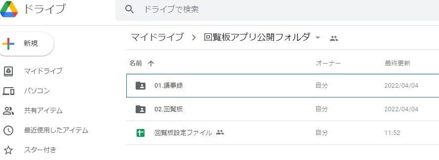
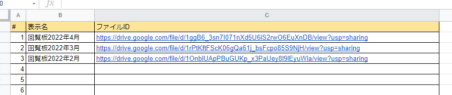

# 概要
  - 自治会の公開情報を１つのアプリ（PWAアプリ）から配信できるサービスです。
  - 同じQRコードを使って、アプリをインストールした仲間内でのみ、情報を表示します。
    - 自治会、こども会、同好会など組織の数だけQRコードを作成すればよいです
  - 自治会運営に以下の点でお困りの方は刺さると思います
    - 回覧板配布に苦労している
    - 自治会役員全員にメール送信しているが、メールが届かず戻ってくる人がいる
    - 自治会からのお知らせを住民ポストに投函している
    - イベント申し込みをスマホから行いたい
  - github pages、googleDriveやgoogleForm等の無料サービスを利用しつつ、できるだけ低コストで運用ができるようにしています。
# ライセンス
- 非商用のみ利用可
- ソフト内で使用しているライブラリの関係上、"GPL v3"としています。
- 使用ライブラリ
  - webix(https://github.com/webix-hub)
  - qr-scanner(https://github.com/nimiq/qr-scanner)
  - PDF.js(https://mozilla.github.io/pdf.js/getting_started/#download)
# 機能
- お知らせ
  - googledriveから指定のファイルをする
  - マークダウン方式で記述可能
  - [osirase_file]
- 回覧板
  - 管理者は指定のGoogleDriveフォルダに、回覧板ファイルを入れる
  - 最新の回覧板ファイルを開くためのショートカット
  - [kairanban_dir]/YYYYMM回覧板.pdf
- 議事録
  - 議事録フォルダ内のファイル一覧を表示する
  - [kairanban_dir]/YYYYMM回覧板.pdf
- イベント予定表
  - 公開用googleカレンダーを表示する
  - [calendar_url]
- 安否確認
  - 災害時安否確認用のgoogleフォームを表示する
  - 防災訓練等で使用する
  - [anpi_url]
- QRコード読み取り
  - QRコード読み取りウィンドウを表示する。読み取ったコードは、コールバック関数に投げる。
- 使い方
  - このソフトの操作マニュアル
- 個人設定
  - アンケートに必要な情報をあらかじめ登録できます
- システム設定にQRコードを表示する
# 起動方法
- ブラウザからURLにアクセスする
  - https://daityu.github.io/kairanban/?API_KEY=[YOUR_API_KEY]&CLIENT_ID=[YOUR_CLIENT_ID]&ICON_DIR=[YOUR_ICON_NO]
- QRコードで上記URLにアクセスする
# 引数、設定値等
- 以下をGoogle Apps Scriptから取得する
- 設定値JSONフォーマット or YAML
  - public_dir:'公開用フォルダ'
  - osirase_file:'お知らせファイル名',
  - calendar_url:'カレンダー',
  - kairanban_dir:'回覧板ディレクトリ',
  - gijiroku_dir:'議事録ディレクトリ',
  - benri_dir:'便利帳ディレクトリ',
  - anpi_url:'安否確認URL(google form)',
- アイコンは下記のが使用できます。
  - https://pictogrammers.github.io/@mdi/font/7.4.47/
  - 自分で作成する場合はこちら
  - https://romannurik.github.io/AndroidAssetStudio/icons-launcher.html
  - アプリアイコンジェネレーター
  - https://www.pwabuilder.com/imageGenerator
- googleFormの初期値（文字列置換）について
  - googleFormの持つ「事前に入力したURLを取得」機能を使用すると、アンケート画面に初期値が設定できます。
  - 特殊文字を設定することで、「個人設定」で設定した値が使用できます。
    - name      名前
    - email     メールアドレス
    - zipcode   郵便番号（ハイフンなし）
    - address   住所
    - address2  建物名等
    - room      部屋番号
    - tel       電話番号
    - group     画面右上のタイトル※自動設定、変更できません
<!-- - カレンダー固有
  - CLIENT_ID:localstrage,町内会単位,googleカレンダーID
  - API_KEY:localstrage,町内会単位,これいるか？？
- カレンダー全体
  - G_CLIENT_ID:CONST,EAC単位,googleカレンダーID
  - G_API_KEY:CONST,EAC単位,これいるか？？ -->
# 今後の実装について
# 運用
  - 初回のみ
    - 設定ファイルを作成する
      - https://docs.google.com/spreadsheets/d/1-srl7Rk73HJPsYi3hVkhMMHvrsvzLe_ua-xm-LyVqck/edit?usp=sharing
    - Google Apps Script保存し、ウェブアプリとして公開する
  - 実際の運用
    - Google Driveにファイルを置く
    
    - Google スプレッドシートを開き、マクロを実行する
    - TODO Google スプレッドシートにファイル一覧を自動登録
    
# その他
- デバッグ（１行でapacheを起動する）
```
# for mac
sudo docker run -d -p 8080:80 -v "./docs":/usr/local/apache2/htdocs/ httpd
# for windows
docker run -d -p 8080:80 -v c:\git\kairanban\docs:/usr/local/apache2/htdocs  httpd
```